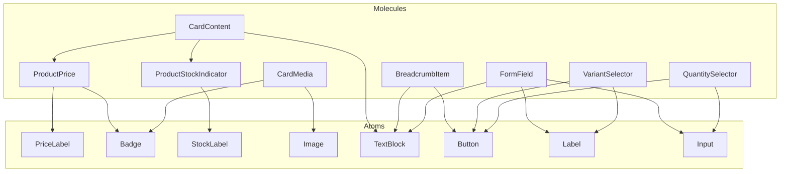

# Phase 4: Molecules

This phase implements reusable MOLECULE components by combining existing atoms following Atomic Design principles.

## Molecules

### 1. ProductPrice
Displays price and optional savings badge.

**Combines:**
- `PriceLabel` (Atom)
- `Badge` (Atom)

**Props:**
| Prop | Type | Default | Description |
|---|---|---|---|
| `price` | `number \| string` | Required | The current price. |
| `compareAtPrice` | `number \| string` | `undefined` | The original price (for sale). |
| `currency` | `string` | `'USD'` | Currency code. |
| `showSavings` | `boolean` | `false` | Whether to show percentage off badge. |

### 2. ProductStockIndicator
Displays stock status with color coding.

**Combines:**
- `StockLabel` (Atom)

**Props:**
| Prop | Type | Default | Description |
|---|---|---|---|
| `quantity` | `number` | Required | Current stock quantity. |
| `lowStockThreshold` | `number` | `10` | Threshold for low stock warning. |

### 3. CardMedia
Displays an image with an optional overlay badge.

**Combines:**
- `Image` (Atom)
- `Badge` (Atom)

**Props:**
| Prop | Type | Default | Description |
|---|---|---|---|
| `src` | `string` | Required | Image source URL. |
| `alt` | `string` | Required | Image alt text. |
| `badgeText` | `string` | `undefined` | Text for overlay badge (e.g., "New"). |
| `aspectRatio` | `string` | `undefined` | Aspect ratio (e.g., 'square', '4by3'). |

### 4. CardContent
Standard content block for product cards.

**Combines:**
- `TextBlock` (Atom)
- `ProductPrice` (Molecule)
- `ProductStockIndicator` (Molecule)

**Props:**
| Prop | Type | Default | Description |
|---|---|---|---|
| `title` | `string` | Required | Product title. |
| `subtitle` | `string` | `undefined` | Product subtitle/description. |
| `price` | `number \| string` | Required | Price. |
| `compareAtPrice` | `number \| string` | `undefined` | Compare at price. |
| `currency` | `string` | `'USD'` | Currency. |
| `quantity` | `number` | `undefined` | Stock quantity (optional). |
| `lowStockThreshold` | `number` | `undefined` | Low stock threshold. |

### 5. BreadcrumbItem
A single item in a breadcrumb navigation.

**Combines:**
- `Button` (Atom, variant="ghost") OR `TextBlock` (Atom)

**Props:**
| Prop | Type | Default | Description |
|---|---|---|---|
| `label` | `string` | Required | Link text. |
| `href` | `string` | Required | Link URL. |
| `isActive` | `boolean` | `false` | Whether this is the current page. |

### 6. FormField
A form field with label, input, and error message.

**Combines:**
- `Label` (Atom)
- `Input` (Atom)
- `TextBlock` (Atom)

**Props:**
| Prop | Type | Default | Description |
|---|---|---|---|
| `label` | `string` | Required | Field label. |
| `required` | `boolean` | `false` | Whether field is required. |
| `error` | `string` | `undefined` | Error message to display. |
| `...inputProps` | `InputHTMLAttributes` | - | Standard input attributes (name, type, etc). |

### 7. VariantSelector
Allows selecting a product variant.

**Combines:**
- `Label` (Atom)
- `Button` (Atom)

**Props:**
| Prop | Type | Default | Description |
|---|---|---|---|
| `options` | `{ label: string; value: string }[]` | Required | List of options. |
| `selected` | `string` | `undefined` | Currently selected value. |
| `name` | `string` | `'Variant'` | Label for the group. |

**Events:**
- `variant-change`: Dispatched when an option is clicked. Detail: `{ value: string, name: string }`.

### 8. QuantitySelector
Input with increment/decrement buttons.

**Combines:**
- `Button` (Atom)
- `Input` (Atom)

**Props:**
| Prop | Type | Default | Description |
|---|---|---|---|
| `value` | `number` | `1` | Current value. |
| `min` | `number` | `1` | Minimum value. |
| `max` | `number` | `99` | Maximum value. |

**Events:**
- `quantity-change`: Dispatched when value changes. Detail: `{ value: number }`.

## Dependency Diagram



## Usage Examples

### Product Price
```astro
<ProductPrice price={19.99} compareAtPrice={29.99} showSavings={true} />
```

### Variant Selector
```astro
<VariantSelector
  options={[{ label: 'S', value: 's' }, { label: 'M', value: 'm' }]}
  selected="m"
/>
<script>
  document.addEventListener('variant-change', (e) => {
    console.log(e.detail.value);
  });
</script>
```
