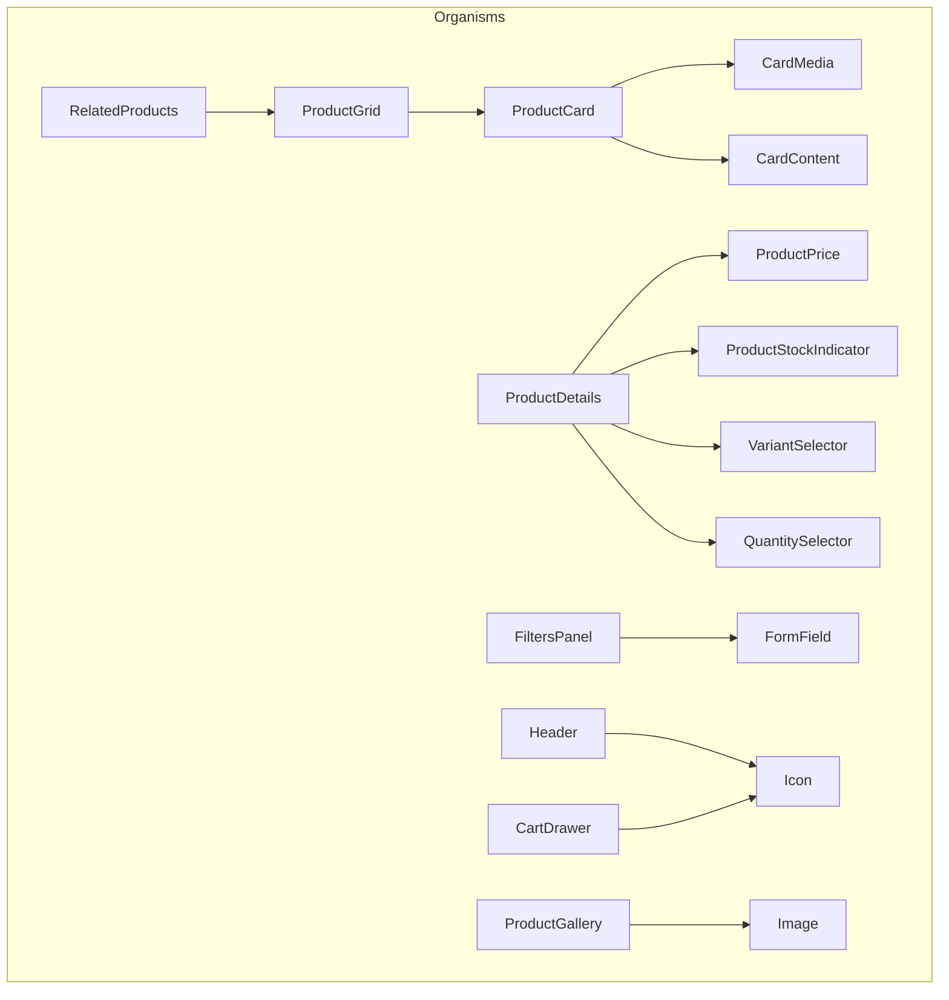

# Phase 5: Organisms

This phase implements reusable ORGANISM components by combining existing atoms and molecules. These components assemble UI but do not contain business logic or fetch data.

## Organisms

### 1. ProductCard
Displays product summary with quick add functionality.

**Combines:** `CardMedia`, `CardContent`, `Button`
**Events:** `add-to-cart`

### 2. ProductGrid
Responsive grid of `ProductCard`s.

**Combines:** `Container`, `ProductCard`
**Props:** `products[]`, `columns`

### 3. FiltersPanel
Form for filtering products.

**Combines:** `FormField`, `Button`
**Events:** `filter-change` (emits all filter data)

### 4. Header
Site header with navigation and cart toggle.

**Combines:** `Container`, `TextBlock`, `Icon`, `Button`
**Events:** `menu-toggle`, `cart-open`

### 5. Footer
Site footer with links.

**Combines:** `Container`, `TextBlock`

### 6. ProductGallery
Interactive image gallery.

**Combines:** `Image` (Atom)
**Events:** `image-change`

### 7. ProductDetails
Full product detail view with variant and quantity selection.

**Combines:** `TextBlock`, `ProductPrice`, `ProductStockIndicator`, `VariantSelector`, `QuantitySelector`, `Button`
**Events:** `variant-change`, `quantity-change`, `add-to-cart`

### 8. CartDrawer
Slide-out cart UI.

**Combines:** `Container` (logic), `TextBlock`, `Button`, `Image`, `Icon`
**Events:** `close`, `remove-item`, `checkout`

### 9. RelatedProducts
Wrapper around `ProductGrid` for related items section.

**Combines:** `ProductGrid`, `Container`, `TextBlock`

## Event Contract

All events are dispatched as `CustomEvent` with `bubbles: true`.

| Event | Detail | Source |
|---|---|---|
| `add-to-cart` | `{ productId: string }` | ProductCard, ProductDetails |
| `variant-change` | `{ value: string, name: string, productId?: string }` | ProductDetails |
| `quantity-change` | `{ value: number, productId?: string }` | ProductDetails |
| `filter-change` | `{ [key: string]: string | string[] }` | FiltersPanel |
| `image-change` | `{ src: string }` | ProductGallery |
| `menu-toggle` | - | Header |
| `cart-open` | - | Header |
| `close` | - | CartDrawer |
| `remove-item` | `{ id: string }` | CartDrawer |
| `checkout` | - | CartDrawer |

## Dependency Diagram

